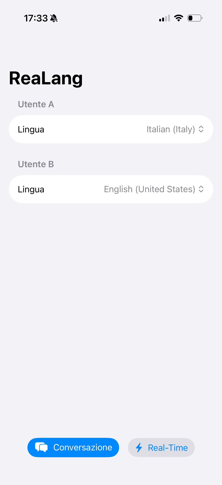
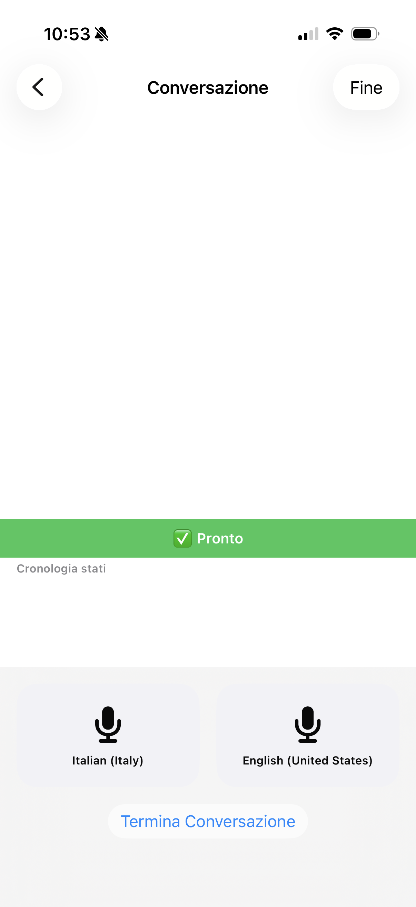
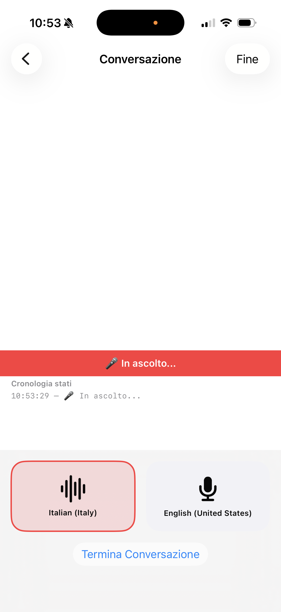
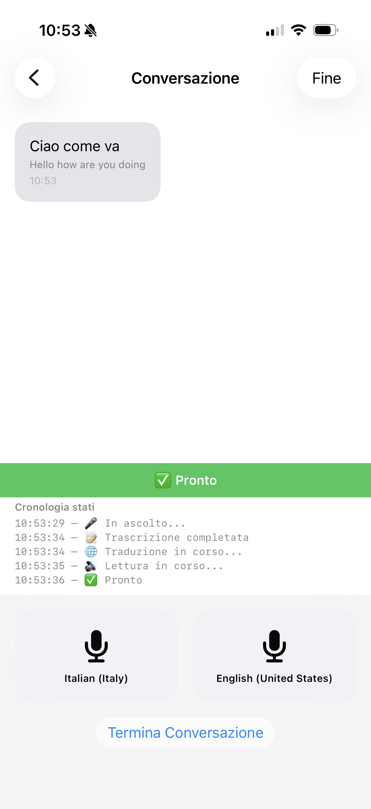
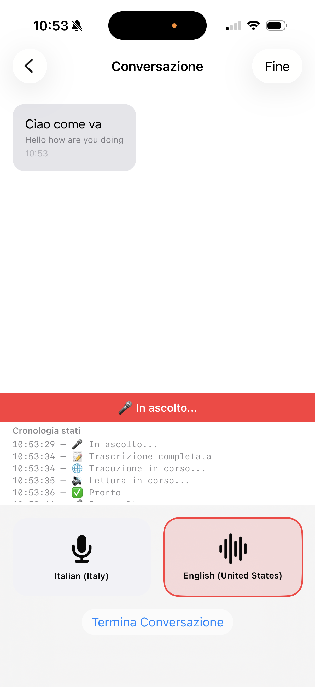
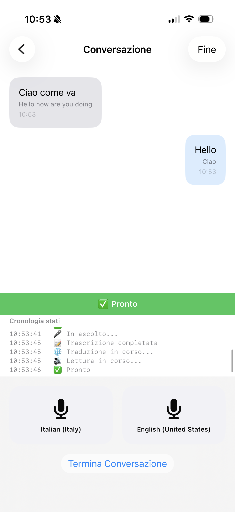
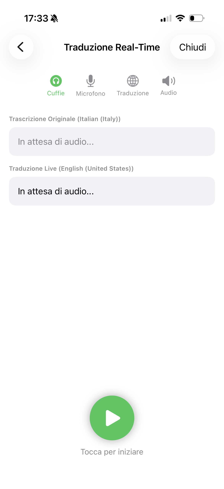
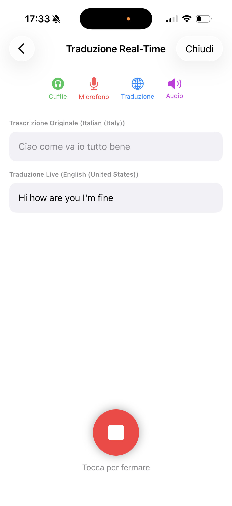
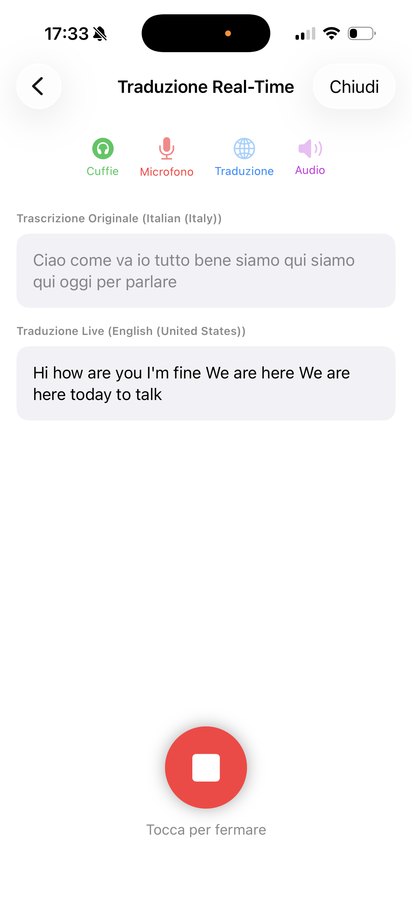

# ReaLang

ReaLang è un'app iOS per la traduzione conversazionale bilingue in tempo reale. Permette a due persone che parlano lingue diverse di comunicare facilmente: ognuno parla nella propria lingua, l'app traduce e legge ad alta voce il messaggio per l'altro interlocutore.

## Funzionamento

1. **Imposta le lingue** — All'avvio, seleziona la lingua di ciascun utente tra le 12 disponibili.
2. **Scegli la modalità** — Avvia una **Conversazione** push-to-talk oppure la **Traduzione Real-Time** continua (richiede cuffie).
3. **Tieni premuto e parla** (Conversazione) — Usa i pulsanti push-to-talk per catturare il parlato.
4. **Ascolta la traduzione** — Il testo viene trascritto, tradotto e letto automaticamente.
5. **Leggi la conversazione** — Lo storico dei messaggi mostra chi ha detto cosa e in quale lingua.

## Requisiti

- iOS 26.0+
- Xcode 16.0+
- Dispositivo fisico iPhone (il riconoscimento vocale live non è supportato su Simulatore)
- Cuffie / auricolari per la modalità Real-Time (per evitare feedback audio)

## Stack Tecnologico

| Componente | Tecnologia |
|------------|------------|
| UI | SwiftUI (Observation) |
| Speech-to-Text | `SFSpeechRecognizer` (continuous + push-to-talk) |
| Traduzione | `Translation` framework |
| Text-to-Speech | `AVSpeechSynthesizer` |
| Audio | `AVAudioEngine` + `AVAudioSession` |
| Generazione progetto | [XcodeGen](https://github.com/yonaskolb/XcodeGen) |

## Build

Il file `project.yml` è la *source of truth* per il progetto Xcode.

```bash
# Rigenera il progetto Xcode (se hai XcodeGen installato)
xcodegen generate

# Build per dispositivo
xcodebuild -project reaLang-native.xcodeproj \
           -scheme reaLangNative \
           -sdk iphoneos \
           -configuration Debug \
           build

# Build per simulatore
xcodebuild -project reaLang-native.xcodeproj \
           -scheme reaLangNative \
           -sdk iphonesimulator \
           -configuration Debug \
           build
```

Per eseguire su dispositivo, apri `reaLang-native.xcodeproj` in Xcode, seleziona il tuo iPhone e premi `Cmd+R`. L'app supporta anche l'installazione wireless su dispositivi paired.

## Permessi

All primo avvio l'app richiede:

- **Microfono** — per ascoltare la conversazione.
- **Riconoscimento vocale** — per trascrivere ciò che dici prima di tradurlo.

## Architettura

- **`ConversationSession`** — Stato centrale `@Observable` che gestisce il flusso della conversazione push-to-talk, i permessi e gli errori.
- **`RealTimeSession`** — Orchestrazione della traduzione continua con pipeline `AsyncStream`, chunking per punteggiatura e timer di stabilizzazione.
- **`SpeechRecognitionService`** — Gestisce l'autorizzazione del microfono, la registrazione e il riconoscimento vocale per il push-to-talk.
- **`StreamingSpeechService`** — Riconoscimento continuo con auto-restart e gestione interruzioni audio.
- **`TextToSpeechService`** — Wrapper attorno ad `AVSpeechSynthesizer` per la sintesi vocale.
- **`StreamingTTSService`** — Coda TTS con tracciamento dello stato `isSpeaking`.
- **`AudioRouteService`** — Rilevamento cuffie / audio esterno; blocca la modalità Real-Time se vengono scollegate.
- **`ConversationView`** — Schermata principale con la lista messaggi, cronologia stati e i controlli push-to-talk.
- **`RealTimeTranslationView`** — Schermata di traduzione continua con indicatori di stato animati, testo live e pulsante di avvio/arresto.
- **`LanguageSetupView`** — Schermata iniziale per la scelta delle due lingue con due pulsanti affiancati (Conversazione / Real-Time).

## Lingue supportate

Italiano, Inglese (US/UK), Spagnolo, Francese, Tedesco, Giapponese, Cinese Semplificato, Portoghese (Brasile), Russo, Coreano, Arabo.

## Screenshot

<p align="center">
  
  
  
</p>
<p align="center">
  
  
  
</p>
<p align="center">
  
  
  
</p>

## Note

- L'audio del riconoscimento vocale viene inviato ai server Apple a meno che il riconoscimento on-device non sia disponibile per la lingua selezionata.
- I messaggi e le traduzioni rimangono esclusivamente in memoria; non vengono salvati su disco né inviati a server di terze parti.
